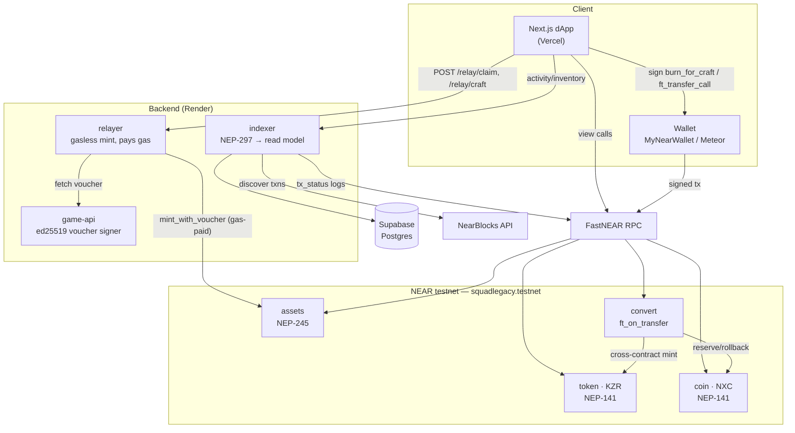
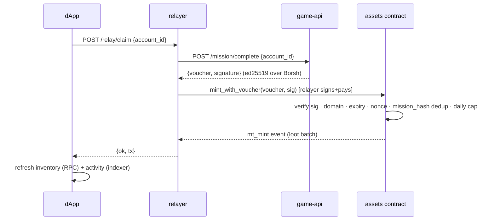
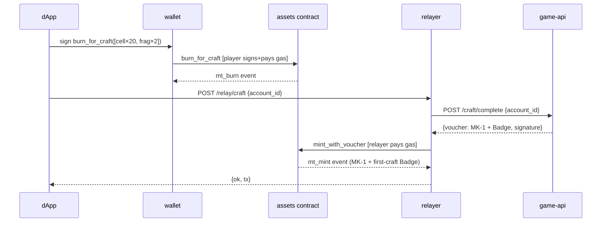
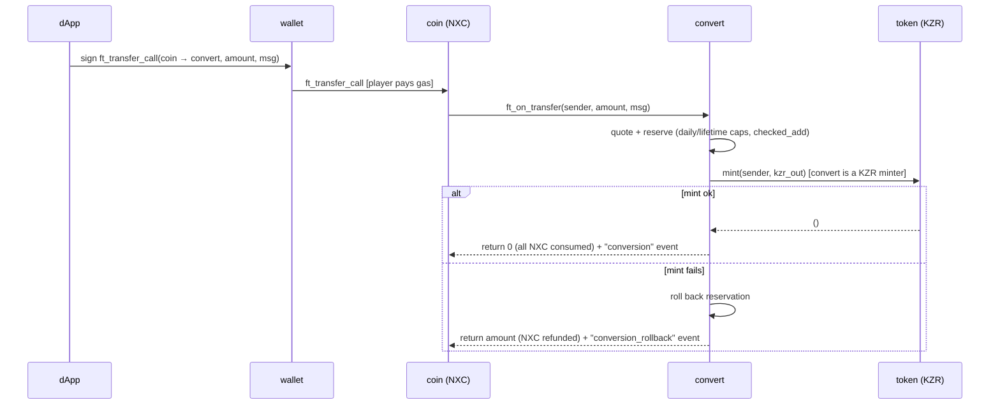

# Architecture — KZR / Ultraverse NEAR vertical slice

This describes the system **as built and deployed**, not the original design doc. It is a living document; update it as the build changes.

## Components

| Layer | Component | Tech | Where it runs |
|---|---|---|---|
| Contracts | `kzr-token` (KZR) | NEP-141, near-sdk 5.29 | `token.squadlegacy.testnet` |
| Contracts | `ingame-coin` (NXC) | NEP-141 + 24h P2P cap | `coin.squadlegacy.testnet` |
| Contracts | `game-assets` | NEP-245 multi-token + ed25519 voucher mint | `assets.squadlegacy.testnet` |
| Contracts | `ingame-conversion` | `ft_on_transfer` receiver, async NXC→KZR | `convert.squadlegacy.testnet` |
| Backend | `game-api` (voucher signer) | TS / Node (`tsx`) | Render → `kzr-game-api.onrender.com` |
| Backend | `relayer` (gasless mint) | TS / Node (`tsx`) + near-api-js 5 | Render → `kzr-relayer.onrender.com` |
| Backend | `indexer` (NEP-297 read model) | TS / Node (`tsx`) + `pg` | Render → `kzr-indexer.onrender.com` |
| Data | read model | Supabase Postgres (`aws-0-ap-southeast-2` pooler) | Supabase |
| Frontend | dApp | Next.js 14 App Router, wallet-selector 8.9 | Vercel → `app-ten-murex-87.vercel.app` |
| Infra accounts | signer / relayer signing keys | ed25519 | `gameapi.` / `relayer.squadlegacy.testnet` |
| External | RPC | FastNEAR (`test.rpc.fastnear.com`) | public |
| External | tx discovery | NearBlocks testnet API | public |

Design intent: **chain state is the source of truth** (frontend reads balances/inventory directly via RPC view calls); the indexer materialises the NEP-297 event history for the activity feed and fast reads. Secrets (signer key, relayer key, DB URL) live only in service env vars, never in the repo.

## Topology

## Flow 1 — Gasless claim (mission loot)

The mint is authorised by the **signer's voucher**, not the player, so the relayer submits it and pays gas. The player needs no key and no NEAR.

## Flow 2 — Craft (burn → gasless mint)

The burn spends the player's own tokens, so it is **wallet-signed**; the crafted output is then minted gaslessly like a claim. On MyNearWallet the burn redirects away and back, so a `localStorage` flag + `transactionHashes` on return **resumes** the mint (a burn can never strand the output).

## Flow 3 — Conversion (async reserve-then-rollback)

Conversion is a one-way NXC→KZR burn+mint. The player calls `ft_transfer_call` on the coin; the coin invokes `convert.ft_on_transfer`, which reserves against the caps, cross-contract-mints KZR, and **rolls the reservation back** if the mint promise fails (funds returned via the `ft_on_transfer` unused-amount contract).

## Trust & security posture

- **Voucher authority.** `game-assets` mints only on an ed25519 signature from the configured `signer_public_key`, bound to `contract_id` + `chain_id` (domain separation), with per-voucher `nonce` (replay guard), `expires_at_ns` (TTL), `mission_hash` (per-mission / per-craft dedup), per-token `max_supply`, and a contract-wide daily mint cap. The signer key lives only in `game-api` env.
- **Relayer scope.** The relayer holds one funded key (`relayer.squadlegacy.testnet`) and only ever calls `mint_with_voucher` on `assets`. It cannot mint arbitrary tokens — every mint still needs a valid signer voucher. Per-account rate limiting guards spend.
- **Player-authorised burns.** `burn_for_craft` and conversion `ft_transfer_call` burn/move the player's own balance and are always wallet-signed; the relayer never moves player funds.
- **Conversion safety.** Reserve-then-rollback keeps caps monotonic even when the async KZR mint fails; caps use `checked_add`. See `docs/audit/AUDIT_READINESS.md`.

## Known gaps (tracked)

- Server-validated mission-state (ordering, min-time gate) + NXC mission reward — **ticket 22**.
- Full NEP-366 meta-transaction gasless burn (function-call access keys) — relayer hardening; the slice ships wallet-signed burns instead.
- KMS custody for signer/relayer keys (currently Render env vars) — **ticket 22**.
- Mainnet cut (Sputnik DAO admin, key-lock immutability) — out of scope for the slice; see `RUNBOOK.md`.
